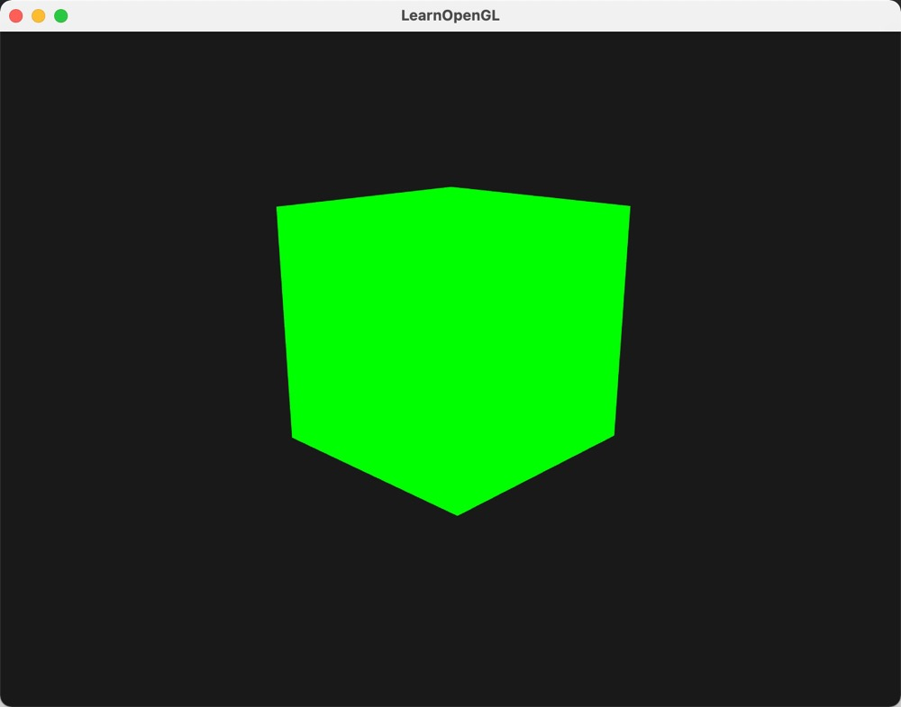
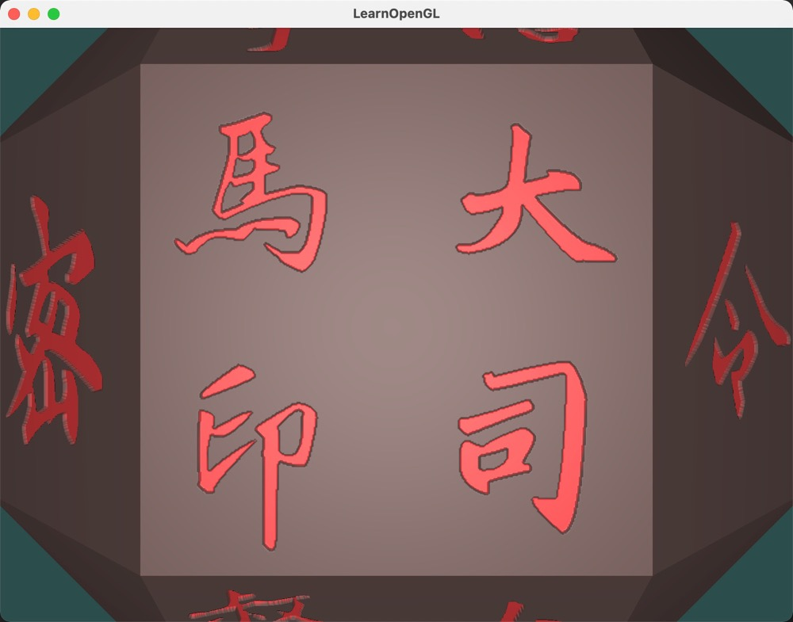

# OpenGLSamples

## 项目简介

此项目是作者在校学习图形学时，制作的OpenGL案例。主要参考了[LearnOpenGL](https://learnopengl-cn.github.io/)代码实现。项目中主要的功能包括：
- **glfw+glad+glm相关OpenGL环境配置**
- **assimp加载模型**
- **opencv摄像头捕获+视频编解码**
- **imgui支持**
- **freetype文字相关**

案例覆盖（48个案例）：
- **LearnOpenGL相关案例。阴影、法线贴图、深度贴图等**
- **光线追踪**
- **后处理**
- **[shaderToy](https://www.shadertoy.com/)、[GLSLSandbox](https://glslsandbox.com/)兼容**
- **OpenCV+Imgui滤镜**
- **分形几何相关**


## 案例
- **[1.创建OpenGL窗口](./samples/1.1-createWindow/)**


- **[2.绘制简单三角形](./samples/1.2-helloTriangle/)**


- **[3.着色器初试](./samples/1.3-helloShader/)**


- **[4.纹理初试](./samples/1.4-helloTexture/)**


- **[5.三维变换](./samples/1.5-helloTransform/)**


- **[6.坐标系统](./samples/1.6-helloCoordinateSystem/)**


- **[7.相机](./samples/1.71-helloCamera/)**


- **[8.第一人称相机](./samples/1.72-camera-freedom/)**


- **[9.简单光照](./samples/2.1-sampleLighting/)**


- **[10.光照贴图](./samples/2.2-lightingTexture/)**


- **[11.射灯](./samples/2.3-castLiting/)**


- **[12.模型加载](./samples/3.1-modelLoading/)**


- **[13.模板测试（描边）](./samples/4.1-stencileTest/)**


- **[14.混合](./samples/4.2-blend/)**


- **[15.透明贴图](./samples/4.3-translucentTexture/)**


- **[16.帧缓冲](./samples/4.4-frameBuffer/)**


- **[17.立方体贴图（天空盒）](./samples/4.5-cubeMap/)**


- **[18.几何着色器](./samples/4.6-geometryShader/)**


- **[19.实例化（草地）](./samples/4.7-instantiation/)**


- **[20.抗锯齿](./samples/4.8-antiAliasing/)**



- **[21.Blinn-Phong光照模型](./samples/5.1-Blinn-Phong/)**


- **[22.Gamma矫正](./samples/5.2-GammaCorrect/)**


- **[23.点阴影](./samples/5.3.1-pointShadow/)**


- **[24.万向阴影](./samples/5.3.2-universalShadow/)**


- **[25.法线贴图](./samples/5.4-normalMap/)**


- **[26.视差贴图](./samples/5.5-parallaxMapping/)**


- **[27.HDR](./samples/5.6-HDR/)**


- **[28.眩光](./samples/5.7-Bloom/)**


- **[29.延迟渲染](./samples/5.8-deferredShading/)**


- **[30.SSAO（屏幕空间环境光遮蔽）](./samples/5.9-ssao/)**


- **[31.光线追踪（球+立方体）](./samples/6.1-rayTracing/)**


- **[32.光线追踪（球，三维谢尔宾斯三角形）](./samples/6.2-rayTracing-Scherbinski_gasket/)**


- **[33.文字渲染）](./samples/7.1-text/)**


## 案例赏析

- **[1.朱莉亚集（Julia-set：分形几何）](./samples/caseForFun/Julia-Set/)**


- **[2.Mandelbrot-Set（分形几何）](./samples/caseForFun/Mandelbrot-Set/)**


- **[3.Worley噪声（分形几何）](./samples/caseForFun/Worley-Noise/)**


- **[4.分形云](./samples/caseForFun/fractalCloud/)**


- **[5.分形山](./samples/caseForFun/fractalMountain/)**


- **[6.洛伦兹吸引子（混沌理论）](./samples/caseForFun/Lorentz-Attractor/)**


- **[7.字符画（OpenCV+OpenGL+Imgui）](./samples/caseForFun/Lorentz-Attractor/)**


- **[8.星系（GLSL Sandbox）](./samples/caseForFun/galaxy/)**


- **[9.imgui测试](./samples/caseForFun/imguiTest/)**


- **[10.路径追踪（GLSL Sandbox）](./samples/caseForFun/rayCasting/)**


- **[11.土星](./samples/caseForFun/saturn/)**


- **[12.海洋](./samples/caseForFun/ocean/)**


- **[13.独孤信印章-视差贴图](./samples/caseForFun/stamp-parallaxMapping/)**



- **[14.独孤信印章](./samples/caseForFun/stamp/)**


- **[15.滤镜测试](./samples/caseForFun/testFilter/)**


## 编译
- **依赖CMake**

```
1.cd OpenGLSamples/
2.mkdir build
3.cd build/
4.cmake ../
5.make
```
编译完后可执行文件在`build/bin/`目录下

## 添加案例
- **在`samples/`下新建文件夹**
- **文件结构：`myTest/src/Test.cpp`**
- **文件结构：此时cmake会扫描添加Test.cpp所在目录下所有`.c、.cpp、.h、.hpp`文件**
- **添加完后重新编译**


